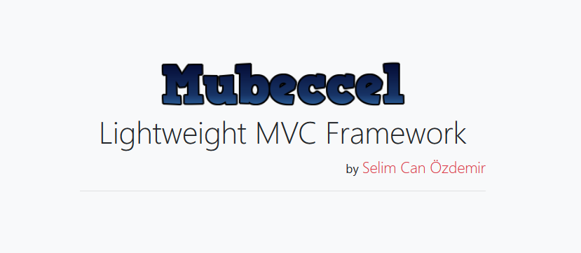

# mubeccel
Mubeccel is a lightweight PHP-MVC Framework
-Selim Can Özdemir


---------------------------------------

Download : <a href="https://selimcan.com/mubeccel/mubeccel.zip">(__click__)</a>

---------------------------------------
# Hakkında

<hr>

Tarih <span class="text-success">27,05,2018</span>. Kodladığım çatının testlerini yaparken bir yandan da 
kendisi üzerinde wiki sitesini hazırlıyorum. Proje yaklaşık 4 gün sürdü. Henüz tamamlanmadı 
ve bugları olabilir, `Eleştirileriniz ve tavsiyeleriniz benim için çok değerli`. Test edebilmeniz için kullanıma sunuyorum.  

Şimdi aklınızdaki bir soru var,
```Piyasada onlarca framework varken neden kendin yazma ihtiyacı hissettin ?``` 
İleride bu sorunun defalarca sorulacağına eminim. Bu yüzden şimdi buna yanıtlar vermeye çalıştım...

Mubeccel Framework'un kodlanma sebepleri: 
<ul>
    <li>
        Kendini gerçekleştirme. <a href="https://en.wikipedia.org/wiki/Maslow%27s_hierarchy_of_needs">( * )</a> xd
    </li>
    <li>
        Web yazılım projelerimi hızlandırmak.
    </li>
    <li>
        Model-View-Controller ( MVC ) mimarisi ve Nesne Tabanlı Programlama ( OOP ) a olan
        hakimiyetimi arttırmak.
    </li>
    <li>
        Web güvenliği tarafındaki eksiklerimi görebilmek.
    </li>
</ul>


# Nasıl Çalışır ?

Çalışması için htaccess ve php7 desteğine ihtiyacınız var. Benim kullandığım htaccess burada buyrun

```
RewriteEngine on
RewriteBase /
RewriteCond %{REQUEST_FILENAME} !-f
RewriteCond %{REQUEST_FILENAME} !-d
RewriteRule ^(.*)$ index.php/$1 [QSA,L]
```
    

Kurulum
İndirdiğiniz dosyaları yanyana çıkartın public_html/ in ismi önemli değil o web dizinine gelmeli ancak diğerini değiştirmemelisiniz !

Geliştirmek istediğimiz web uygulamasını modüllere ayırıp ( Home, User, Admin, Editor) gibi. Her modül için 'Mubeccel/Apps/' dizini altında klasörünü açmalıyız. Dizin yapısı Aşağıdakine benzer olmalıdır.

```
Apps/
  home/
      Views/
      homeController.php
      homeModel.php
  wiki/
```
Url Yapımız : localhost/controller/action/parametre (parametre zorunlu değil, ileride göreceğiz). 


# Controller

homeController.php dosyasını oluşturduktan sonra içinde `homeController` sınıfını tanımlıyoruz.


```
<?php
    class homeController{
        //
    }
?>
```
Burada Controller sınıfının yeteneklerinden biraz bahsetmeliyim. Sınıfımızda çalışmasını istediğimiz her sayfanın fonksiyonunu eklemeliyiz. Yani '/home/index' e gitmek istiyorsak homeController' da index adında bir fonksiyon oluşturmalıyız. Bunu yaparken;


```
<?php
class homeController{
    
    public function index($param){
        return View::load("main", "index");
    }

}
?>
```
$param değeri opsiyoneldir. İhtiyaç yoksa (pagination vs) burada bu şekilde tanımlamak yerine index() diyerek de geçebiliriz.

```return View::load("main", "index");``` kısmında ```load($layoutName, $viewName)``` olarak çalışır. Esnek bir şekilde hem layout hem de view i buradan editleyebiliriz. 


# View

Controller sınıfımızdan `View::load()` statik metodu ile View dosyalarımızı çağırırız. Ardından `Apps/Layouts/` dizini altında layout dosyamızı oluşturuyoruz örnek: 'main.php'. Layout dosyamızı düzenledikten sonra view'in gelmesi gereken yere aşağıdaki kodu eklemeliyiz.
<?=View::render()?>

Controller tarafından view e değişken ulaştırabilmek için View::$content[]; statik arrayi kullanabiliriz. Örnek ```View::$content["name"]; ```


# Model

Model, veritabanı ve Controller arasında köprü görevi gören kısımdır. Mubeccel/Core/Config.php içinde mysql giriş bilgilerini değiştirebilirsiniz. Ben sql injectiondan korunmak için phpr - Veritabanı Sınıfı nı hazır olarak bağladım. Örnek Model Class ımızı da oluşturuyoruz.
```
class homeModel extends Model{

    public static function get_helloworld(){
        return "hello world";
    }
}
```

Controller kısmından rahatça ```homeModel::get_helloworld();``` diyerek çağırabilmek için statik oluşturduk. 


# Routing

Mubeccel Routing yani yönlendirmeyi de destekliyor. Normalde parçalı url ler kullanırken /home/index, ya da /wiki/page/2 gibi durumlarda Mubeccel otomatik olarak gideceğiniz controller ı ve fonksiyonu seçer. Ancak tek parçalı url olursa yani direk /iletisim gibi durumlarda anlaması mümkün değildir. Burada devreye routing sistemi girer.

Mubeccel/Route.php konumunda route olayını görebilirsiniz.
```
Statik fonksiyonun
1. parametresi: tetikleyecek url, 
2. parametresi: gideceğimiz controller,
3. parametresi: çalışacak fonksiyon.
```
